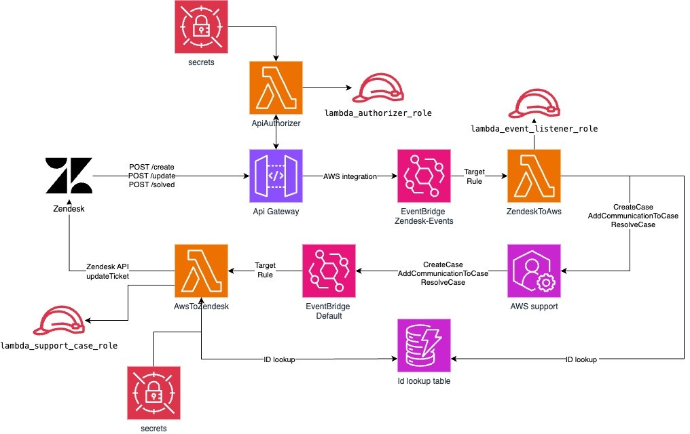

<div align="left" style="position: relative;">
<h1>ZENDESK-AWS-SUPPORT</h1>
<p align="left">
  <em>Bridging Support, Powering Solutions!</em>
</p>


<p align="left">
  
  
  
  
</p>
<p align="left">Built with the tools and technologies:</p>
    
 </p>
<p align="left">
  
  
  </p>
  <p align="left">
    
    
    
      </p>
        <p align="left">
    
    
    
    
        
                
  
</p>
</div>
<br clear="right">

##  Table of Contents

- [ Overview](#-overview)
- [ Project Structure](#-project-structure)
  - [ Project Index](#-project-index)
  - [ Project Architecture](#-project-architecture)
- [ Getting Started](#-getting-started)
  - [ Prerequisites](#-prerequisites)
  - [ Installation](#-installation)
  - [ Zendesk configuration](#-zendesk-configuration)
- [ Contributing](#-contributing)
- [ License](#-license)
- [ Acknowledgments](#-acknowledgments)


---

##  Overview

The zendesk-aws-support project seamlessly integrates Zendesk with AWS, automating customer support workflows and enhancing case management. By leveraging serverless architecture, it ensures efficient synchronization between support tickets and AWS events, providing robust, secure, and scalable solutions. Ideal for organizations looking to streamline their customer service operations and maintain high responsiveness in cloud environments.

---

##  Project Structure

```sh
└── zendesk-aws-support/
    ├── Makefile
    ├── README.md
    ├── lambdas
    │   ├── api_authorizer
    │   │   └── handler.py
    │   ├── aws_to_zendesk
    │   │   └── handler.py
    │   ├── shared
    │   │   ├── __init__.py
    │   │   ├── dynamo_utils.py
    │   │   ├── logger.py
    │   │   ├── secrets.py
    │   │   └── zendesk_api.py
    │   └── zendesk_to_aws
    │       └── handler.py
    ├── platform
    │   ├── .terraform.lock.hcl
    │   ├── apiGateway.tf
    │   ├── dlq.tf
    │   ├── dynamodb.tf
    │   ├── eventbridge.tf
    │   ├── iam_policies.tf
    │   ├── kms.tf
    │   ├── lambdaApiAuthorizer.tf
    │   ├── lambdaAwsToZendesk.tf
    │   ├── lambdaZendeskToAws.tf
    │   ├── policies
    │   │   ├── api_secretsmanager_policy.tpl.json
    │   │   ├── default_bus_access_policy.tpl.json
    │   │   ├── dlq_policy.tpl.json
    │   │   ├── dynamo_rbac.tpl.json
    │   │   ├── edit_support_cases.json
    │   │   ├── get_api_secret_policy.tpl.json
    │   │   ├── get_zd_secret_policy.tpl.json
    │   │   ├── logging_tracing_policy.json
    │   │   ├── lookup_db_policy.tpl.json
    │   │   └── webhook_bus_access_policy.tpl.json
    │   ├── provider.tf
    │   ├── secret_api_gateway.tf
    │   ├── secret_zendesk.tf
    │   ├── tofill.auto.tvars
    │   └── variables.tf
    └── requirements.txt
```


### Project Index
<details open>
  <summary><b><code>ZENDESK-AWS-SUPPORT/</code></b></summary>
  <details> <!-- __root__ Submodule -->
    <summary><b>__root__</b></summary>
    <blockquote>
      <table>
      <tr>
        <td><b><a href='https://github.com/flozonn/zendesk-aws-support/blob/master/requirements.txt'>requirements.txt</a></b></td>
        <td>- Manages dependencies for AWS services integration within the project, specifically focusing on AWS SDK for Python (Boto3) and AWS X-Ray SDK<br>- These libraries facilitate interaction with AWS services and enable tracing of the application requests, respectively, ensuring efficient cloud resource management and performance monitoring across the entire codebase architecture.</td>
      </tr>
      <tr>
        <td><b><a href='https://github.com/flozonn/zendesk-aws-support/blob/master/Makefile'>Makefile</a></b></td>
        <td>- The Makefile orchestrates the build, packaging, deployment, and maintenance of Lambda functions within a serverless architecture<br>- It automates tasks such as dependency installation, source code compilation into distributable formats, and deployment via Terraform, while also facilitating cleanliness and security checks to ensure robust, secure application delivery.</td>
      </tr>
      </table>
    </blockquote>
  </details>
  <details> <!-- lambdas Submodule -->
    <summary><b>lambdas</b></summary>
    <blockquote>
      <details>
        <summary><b>shared</b></summary>
        <blockquote>
          <table>
          <tr>
            <td><b><a href='https://github.com/flozonn/zendesk-aws-support/blob/master/lambdas/shared/logger.py'>logger.py</a></b></td>
            <td>- Establishes a centralized logging utility within the codebase, enabling consistent logging practices across various components<br>- The `get_logger` function configures and returns a logger instance with a standard format and INFO level, ensuring that all modules have access to uniform log management for easier maintenance and debugging.</td>
          </tr>
          <tr>
            <td><b><a href='https://github.com/flozonn/zendesk-aws-support/blob/master/lambdas/shared/dynamo_utils.py'>dynamo_utils.py</a></b></td>
            <td>- Manages DynamoDB interactions within the serverless architecture, specifically handling the retrieval and storage of lookup IDs<br>- Utilizes AWS SDK to connect to DynamoDB, fetching and inserting data based on environment-specific table names<br>- Essential for maintaining data consistency and accessibility across various components of the application.</td>
          </tr>
          <tr>
            <td><b><a href='https://github.com/flozonn/zendesk-aws-support/blob/master/lambdas/shared/zendesk_api.py'>zendesk_api.py</a></b></td>
            <td>- Manages interactions with the Zendesk API by updating ticket details based on specified parameters<br>- It authenticates using environment-specific credentials, modifies ticket status and comments, and supports conditional resolution of tickets<br>- This module is essential for automating customer support workflows within the project's architecture.</td>
          </tr>
          <tr>
            <td><b><a href='https://github.com/flozonn/zendesk-aws-support/blob/master/lambdas/shared/secrets.py'>secrets.py</a></b></td>
            <td>- Retrieves and returns secret values securely from AWS Secrets Manager, handling potential errors during retrieval<br>- The function dynamically sets the AWS region, either from a provided parameter or environment variable, ensuring flexibility across different deployment environments<br>- This component is crucial for managing sensitive configurations within the broader application infrastructure.</td>
          </tr>
          </table>
        </blockquote>
      </details>
      <details>
        <summary><b>zendesk_to_aws</b></summary>
        <blockquote>
          <table>
          <tr>
            <td><b><a href='https://github.com/flozonn/zendesk-aws-support/blob/master/lambdas/zendesk_to_aws/handler.py'>handler.py</a></b></td>
            <td>- Handles interactions between Zendesk and AWS by creating, updating, and resolving support cases based on webhook events<br>- It utilizes AWS Lambda to process events, manage case communications, and synchronize case IDs between systems, ensuring efficient tracking and updates of support issues.</td>
          </tr>
          </table>
        </blockquote>
      </details>
      <details>
        <summary><b>api_authorizer</b></summary>
        <blockquote>
          <table>
          <tr>
            <td><b><a href='https://github.com/flozonn/zendesk-aws-support/blob/master/lambdas/api_authorizer/handler.py'>handler.py</a></b></td>
            <td>- Handles API authorization by verifying incoming request tokens against a secured API key<br>- Utilizes a centralized logging service and secure key management to ensure robust security practices<br>- Primarily functions to authenticate API requests, directly influencing access control within the serverless architecture of the project.</td>
          </tr>
          </table>
        </blockquote>
      </details>
      <details>
        <summary><b>aws_to_zendesk</b></summary>
        <blockquote>
          <table>
          <tr>
            <td><b><a href='https://github.com/flozonn/zendesk-aws-support/blob/master/lambdas/aws_to_zendesk/handler.py'>handler.py</a></b></td>
            <td>- Handles AWS support case communications by updating corresponding Zendesk tickets based on event triggers<br>- It either adds new communications to a ticket or marks it as resolved, ensuring synchronization between AWS support cases and Zendesk ticket statuses<br>- This integration facilitates efficient customer support management.</td>
          </tr>
          </table>
        </blockquote>
      </details>
    </blockquote>
  </details>
  <details> <!-- platform Submodule -->
    <summary><b>platform</b></summary>
    <blockquote>
      <table>
      <tr>
        <td><b><a href='https://github.com/flozonn/zendesk-aws-support/blob/master/platform/eventbridge.tf'>eventbridge.tf</a></b></td>
        <td>- Establishes and configures AWS EventBridge resources to automate responses to specific events<br>- It sets up event buses and rules to trigger AWS Lambda functions for handling Zendesk webhook events and AWS support case notifications, ensuring efficient, event-driven operations within the cloud environment.</td>
      </tr>
      <tr>
        <td><b><a href='https://github.com/flozonn/zendesk-aws-support/blob/master/platform/lambdaAwsToZendesk.tf'>lambdaAwsToZendesk.tf</a></b></td>
        <td>- Establishes an AWS Lambda function named "AwsToZendesk" designed to integrate AWS support case monitoring with Zendesk<br>- It configures necessary IAM roles and policies for secure operation, sets up a CloudWatch log group for logging, and defines environment variables and resources to ensure the function operates within specified security and performance parameters.</td>
      </tr>
      <tr>
        <td><b><a href='https://github.com/flozonn/zendesk-aws-support/blob/master/platform/kms.tf'>kms.tf</a></b></td>
        <td>- Establishes an AWS KMS key specifically for encrypting a DynamoDB table, enhancing data security<br>- It features automatic key rotation and a defined deletion window<br>- The policy permits multiple AWS services, including DynamoDB, SQS, Secrets Manager, CloudWatch, and specific Lambda roles, to utilize this key for various encryption and decryption operations, ensuring broad but controlled access across the architecture.</td>
      </tr>
      <tr>
        <td><b><a href='https://github.com/flozonn/zendesk-aws-support/blob/master/platform/dynamodb.tf'>dynamodb.tf</a></b></td>
        <td>- Defines and configures a DynamoDB table named "idslookup" within the AWS infrastructure, utilizing a pay-per-request billing model<br>- It is designed for secure ID storage with server-side encryption and point-in-time recovery features<br>- The table uses a single string-type attribute as its hash key for efficient data retrieval and includes operational tags for easier resource management.</td>
      </tr>
      <tr>
        <td><b><a href='https://github.com/flozonn/zendesk-aws-support/blob/master/platform/provider.tf'>provider.tf</a></b></td>
        <td>- Defines the AWS provider configuration for the project, specifying the region setting based on a variable input<br>- This setup is crucial for the deployment and management of all AWS resources utilized across the entire codebase, ensuring that operations are executed in the correct geographical location as defined by the project's infrastructure requirements.</td>
      </tr>
      <tr>
        <td><b><a href='https://github.com/flozonn/zendesk-aws-support/blob/master/platform/apiGateway.tf'>apiGateway.tf</a></b></td>
        <td>- Establishes an AWS API Gateway to handle webhook events from Zendesk, integrating with AWS EventBridge for event management<br>- It configures routes for creating, updating, and solving events, each secured with custom authorization<br>- Additionally, it sets up logging, permissions, and roles to ensure secure and efficient event processing and monitoring.</td>
      </tr>
      <tr>
        <td><b><a href='https://github.com/flozonn/zendesk-aws-support/blob/master/platform/lambdaApiAuthorizer.tf'>lambdaApiAuthorizer.tf</a></b></td>
        <td>- Defines and configures an AWS Lambda function named "ApiAuthorizer" to serve as a request authorizer for an API Gateway, utilizing specific IAM roles and policies for security and logging<br>- It integrates environment variables, dead letter queues, and KMS for encryption, ensuring robust, secure request handling and error management in cloud operations.</td>
      </tr>
      <tr>
        <td><b><a href='https://github.com/flozonn/zendesk-aws-support/blob/master/platform/dlq.tf'>dlq.tf</a></b></td>
        <td>- Defines an AWS SQS queue named "zendesk-to-aws-dlq" to serve as a dead-letter queue for handling message processing failures in the system<br>- It utilizes an AWS KMS key for encryption, enhancing security by specifying key reuse parameters<br>- This setup is crucial for robust error handling and data integrity within the project's cloud architecture.</td>
      </tr>
      <tr>
        <td><b><a href='https://github.com/flozonn/zendesk-aws-support/blob/master/platform/lambdaZendeskToAws.tf'>lambdaZendeskToAws.tf</a></b></td>
        <td>- Establishes an AWS Lambda function named "ZendeskToAws" designed to handle events, equipped with necessary IAM roles and policies for accessing various AWS services<br>- It configures security, logging, and error handling settings to ensure robust operation, including integration with DynamoDB, CloudWatch, and SQS for comprehensive service interaction and monitoring.</td>
      </tr>
      <tr>
        <td><b><a href='https://github.com/flozonn/zendesk-aws-support/blob/master/platform/secret_zendesk.tf'>secret_zendesk.tf</a></b></td>
        <td>- Manages the storage and versioning of the Zendesk API key within AWS Secrets Manager, ensuring secure access and management<br>- The configuration specifies the use of a KMS key for encryption and maintains the API key's lifecycle by defining its version stages, thereby integrating critical external service credentials securely into the system's architecture.</td>
      </tr>
      <tr>
        <td><b><a href='https://github.com/flozonn/zendesk-aws-support/blob/master/platform/secret_api_gateway.tf'>secret_api_gateway.tf</a></b></td>
        <td>- Manages the creation and versioning of an AWS Secrets Manager secret specifically for storing an API gateway API key<br>- It securely associates the key with a KMS key for encryption and handles the lifecycle of the secret's versions to ensure the current version is used within the system.</td>
      </tr>
      <tr>
        <td><b><a href='https://github.com/flozonn/zendesk-aws-support/blob/master/platform/tofill.auto.tvars'>tofill.auto.tvars</a></b></td>
        <td>- Defines configuration settings for a specific regional deployment in the EU-West-1 zone, including identifiers for a case ID lookup service and credentials for Zendesk integration<br>- These settings are crucial for ensuring that the application interacts correctly with external services and maintains proper data localization and security compliance within the specified region.</td>
      </tr>
      <tr>
        <td><b><a href='https://github.com/flozonn/zendesk-aws-support/blob/master/platform/variables.tf'>variables.tf</a></b></td>
        <td>- Defines essential configuration variables for a deployment platform, including regional settings, storage for ID lookups, and authentication details for Zendesk integration<br>- These variables facilitate regional deployment customization, secure storage access, and enable interactions with the Zendesk API for customer support functionalities.</td>
      </tr>
      <tr>
        <td><b><a href='https://github.com/flozonn/zendesk-aws-support/blob/master/platform/iam_policies.tf'>iam_policies.tf</a></b></td>
        <td>- Defines and manages multiple AWS IAM policies crucial for operational security and access control within the system<br>- These policies regulate access to AWS resources like DynamoDB, Secrets Manager, and Event Buses, ensuring that only authorized services and roles can interact with these resources, thereby enhancing the security and efficiency of the system's cloud operations.</td>
      </tr>
      </table>
      <details>
        <summary><b>policies</b></summary>
        <blockquote>
          <table>
          <tr>
            <td><b><a href='https://github.com/flozonn/zendesk-aws-support/blob/master/platform/policies/default_bus_access_policy.tpl.json'>default_bus_access_policy.tpl.json</a></b></td>
            <td>- Defines the access policy for the default event bus within the platform, specifying permissions for describing rules, posting events, and retrieving the event bus<br>- It uses a templated JSON structure to dynamically insert the resource ARN, ensuring that permissions are correctly aligned with the specified resource within the broader system architecture.</td>
          </tr>
          <tr>
            <td><b><a href='https://github.com/flozonn/zendesk-aws-support/blob/master/platform/policies/get_api_secret_policy.tpl.json'>get_api_secret_policy.tpl.json</a></b></td>
            <td>- Defines a security policy within the platform's architecture, specifically granting permissions to retrieve API secret values from a secrets manager<br>- It ensures that only authorized actions can access sensitive API credentials, aligning with best practices for secure access management in distributed systems<br>- This policy is crucial for maintaining the integrity and confidentiality of API interactions.</td>
          </tr>
          <tr>
            <td><b><a href='https://github.com/flozonn/zendesk-aws-support/blob/master/platform/policies/webhook_bus_access_policy.tpl.json'>webhook_bus_access_policy.tpl.json</a></b></td>
            <td>- Defines access policies for the webhook event bus within the platform, specifically allowing operations such as describing rules, posting events, and retrieving the event bus<br>- It ensures that interactions with the webhook bus are securely managed by specifying permissions linked to the webhook bus resource identifier.</td>
          </tr>
          <tr>
            <td><b><a href='https://github.com/flozonn/zendesk-aws-support/blob/master/platform/policies/api_secretsmanager_policy.tpl.json'>api_secretsmanager_policy.tpl.json</a></b></td>
            <td>- Defines a policy template for AWS Secrets Manager that grants specified AWS Lambda roles the permission to access secret values<br>- This policy is crucial for secure, role-based access to sensitive configurations, ensuring that only authorized services can retrieve necessary secrets for operational tasks within the system architecture.</td>
          </tr>
          <tr>
            <td><b><a href='https://github.com/flozonn/zendesk-aws-support/blob/master/platform/policies/get_zd_secret_policy.tpl.json'>get_zd_secret_policy.tpl.json</a></b></td>
            <td>- Grants specific permissions within the broader system architecture, enabling secure access to Zendesk secret values via AWS Secrets Manager<br>- This policy template is crucial for managing access controls, ensuring that only authorized actions are permitted on designated resources, thereby enhancing the security and operational integrity of the platform.</td>
          </tr>
          <tr>
            <td><b><a href='https://github.com/flozonn/zendesk-aws-support/blob/master/platform/policies/edit_support_cases.json'>edit_support_cases.json</a></b></td>
            <td>- Grants comprehensive permissions for managing support cases across the platform<br>- Positioned within the policies directory, it defines broad access rights specifically for support-related actions, ensuring that users can fully interact with and resolve support issues without restrictions, thereby enhancing the support workflow within the system's architecture.</td>
          </tr>
          <tr>
            <td><b><a href='https://github.com/flozonn/zendesk-aws-support/blob/master/platform/policies/logging_tracing_policy.json'>logging_tracing_policy.json</a></b></td>
            <td>- Establishes permissions for logging and tracing activities within the platform, specifically enabling actions related to AWS X-Ray services<br>- It allows the recording of trace segments and telemetry, along with the retrieval of sampling rules, targets, and statistical summaries, ensuring comprehensive monitoring and diagnostic capabilities across all resources.</td>
          </tr>
          <tr>
            <td><b><a href='https://github.com/flozonn/zendesk-aws-support/blob/master/platform/policies/dlq_policy.tpl.json'>dlq_policy.tpl.json</a></b></td>
            <td>- Defines a security policy template for managing permissions related to sending messages to a specified dead-letter queue (DLQ) in Amazon SQS<br>- It ensures that only authorized actions can be performed on the DLQ, enhancing the robustness and security of the system's error handling mechanisms within the broader project infrastructure.</td>
          </tr>
          <tr>
            <td><b><a href='https://github.com/flozonn/zendesk-aws-support/blob/master/platform/policies/dynamo_rbac.tpl.json'>dynamo_rbac.tpl.json</a></b></td>
            <td>- Defines a role-based access control policy for AWS DynamoDB, specifying permissions for two Lambda roles to perform operations like item retrieval, updates, and deletions on a specified table<br>- This policy ensures that only authorized roles within the specified AWS account can access and manipulate the designated DynamoDB resource, aligning with security and operational protocols.</td>
          </tr>
          <tr>
            <td><b><a href='https://github.com/flozonn/zendesk-aws-support/blob/master/platform/policies/lookup_db_policy.tpl.json'>lookup_db_policy.tpl.json</a></b></td>
            <td>- Defines a set of permissions for interacting with a specific DynamoDB table, enabling actions such as querying, updating, and managing the table<br>- It is crucial for regulating access within the system, ensuring that operations on the database are securely managed according to the specified policy rules.</td>
          </tr>
          </table>
        </blockquote>
      </details>
    </blockquote>
  </details>
</details>

---
###  Project Architecture 



## Getting Started

###  Prerequisites

Before getting started with zendesk-aws-support, ensure your runtime environment meets the following requirements:

- **Programming Language:** Terraform & Python 3


###  Installation

Install zendesk-aws-support using the following methods:

**Build from source:**

1. Clone the zendesk-aws-support repository:
```sh
❯ git clone https://github.com/flozonn/zendesk-aws-support
```

2. Navigate to the project directory:
```sh
❯ cd zendesk-aws-support
```


3. Install the project dependencies:

```sh
❯ fill the required variables in tofilll.auto.tfvars
❯ make zip
❯ make deploy
```
4. Retrieve the API gateway URL after deployment

Fill in the form in /platform/tofill.auto.tfvars
```
region              = "eu-west-1"
id_lookup_bucket    = "case-ids-lookup-<randomId>"
zendesk_subdomain   = "your_subdomain" // For example "companyName"
zendesk_admin_email = "your_admin_email" // For example "toto@amazon.com"
zendesk_token       = "your_api_key"    // From Zendesk Admin Panel
bearer_token        = "Bearer <your_token>" // token generated by you
```

###  Zendesk configuration

#### 1.Create 3 custom fields
First create 3 additional custom fields in the Zendesk form to gather data about Severity, Impacted Service and Category of the case: 
- Field named AWS Service should be a drop down field with serviceCodes value (SageMaker)
- Field named Category code should be a drop down field with all the possible categoryCodes for a give serviceCode (cf file in /zendeskResources directory).
- Field named Severity should be a drop down field with ["urgent","high","normal","low","critical"]
#### 2.Create Webhooks
Then create 3 webhooks:
- aws support - solved, endpoint = https://your_gateway_url/solved 
- aws support - update, endpoint = https://your_gateway_url/update 
- aws support - create , endpoint = https://your_gateway_url/create   

⚠️ When creating the webhook select Authentication + Bearer token and add the bearer_token variable from /platform/tofill.auto.tfvars


####  3.Create Triggers
From the Zendesk Admin Panel, create **3 triggers** (under *Objects and Rules*).
##### create_ticket_trigger
- **Name:** `create_ticket_trigger`
- **Trigger Category:** Notifications
- **Conditions:**
  - `Ticket > Ticket + Is + Created`
- **Actions:**
  - `Notify by > Active Webhook + aws support - create`
  - **Method:** `POST`
  - **Data:**
    ```json
    { 
      "zd_ticket_id": {{ticket.id}}, 
      "zd_ticket_desc": "{{ticket.description}}",
      "zd_ticket_requester_email": "{{ticket.requester.email}}",
      "zd_ticket_latest_public_comment": "{{ticket.latest_public_comment_html}}",
      "zd_ticket_impacted_service": "{{ticket.ticket_field_<Replace_with_custome_fieldID>}}",
      "zd_ticket_category_code": "{{ticket.ticket_field_<Replace_with_custome_fieldID>}}",
      "zd_ticket_sev_code": "{{ticket.ticket_field_<Replace_with_custome_fieldID>}}"
    }
    ```

---

##### update_ticket_trigger
- **Name:** `update_ticket_trigger`
- **Trigger Category:** Notifications
- **Conditions:**
  - `Ticket > Ticket + Is + Updated`
  - `Ticket > Update Via + Is Not + Web service (API)`
- **Actions:**
  - `Notify by > Active Webhook + aws support - update`
  - **Method:** `POST`
  - **Data:**
    ```json
    { 
      "zd_ticket_id": {{ticket.id}}, 
      "zd_ticket_desc": "{{ticket.description}}",
      "zd_ticket_requester_email": "{{ticket.requester.email}}",
      "zd_ticket_latest_public_comment": "{{ticket.latest_public_comment_html}}"
    }
    ```

---

##### solved_ticket_trigger
- **Name:** `solved_ticket_trigger`
- **Trigger Category:** Notifications
- **Conditions:**
  - `Ticket > Ticket Status + Changed To + Solved`
- **Actions:**
  - `Notify by > Active Webhook + aws support - solved`
  - **Method:** `POST`
  - **Data:**
    ```json
    { 
      "zd_ticket_id": {{ticket.id}}, 
      "zd_ticket_desc": "{{ticket.description}}",
      "zd_ticket_requester_email": "{{ticket.requester.email}}",
      "zd_ticket_latest_public_comment": "{{ticket.latest_public_comment_html}}"
    }
    ```
---
### 4. Create a ticket

Access the default form from the url 
```
https://<domain>.zendesk.com/hc/fr/requests/new?ticket_form_id=<form_id>
```


## 🔰 Contributing

- **💬 [Join the Discussions](https://github.com/flozonn/zendesk-aws-support/discussions)**: Share your insights, provide feedback, or ask questions.
- **🐛 [Report Issues](https://github.com/flozonn/zendesk-aws-support/issues)**: Submit bugs found or log feature requests for the `zendesk-aws-support` project.
- **💡 [Submit Pull Requests](https://github.com/flozonn/zendesk-aws-support/blob/main/CONTRIBUTING.md)**: Review open PRs, and submit your own PRs.

<details closed>
<summary>Contributing Guidelines</summary>

1. **Fork the Repository**: Start by forking the project repository to your github account.
2. **Clone Locally**: Clone the forked repository to your local machine using a git client.
   ```sh
   git clone https://github.com/flozonn/zendesk-aws-support
   ```
3. **Create a New Branch**: Always work on a new branch, giving it a descriptive name.
   ```sh
   git checkout -b new-feature-x
   ```
4. **Make Your Changes**: Develop and test your changes locally.
5. **Commit Your Changes**: Commit with a clear message describing your updates.
   ```sh
   git commit -m 'Implemented new feature x.'
   ```
6. **Push to github**: Push the changes to your forked repository.
   ```sh
   git push origin new-feature-x
   ```
7. **Submit a Pull Request**: Create a PR against the original project repository. Clearly describe the changes and their motivations.
8. **Review**: Once your PR is reviewed and approved, it will be merged into the main branch. Congratulations on your contribution!
</details>

<details closed>
<summary>Contributor Graph</summary>
<br>
<p align="left">
   <a href="https://github.com{/flozonn/zendesk-aws-support/}graphs/contributors">
      
   </a>
</p>
</details>

---

